# Messenger

A real-time chat application with WebSocket support, featuring a modern UI and internationalization capabilities.

## Languages
This documentation is available in the following languages:
- [English (US)](README.md)
- [English (UK)](docs/README-en-GB.md)
- [Japanese](docs/README-ja.md)
- [Korean](docs/README-ko.md)
- [Chinese (Simplified)](docs/README-zh-CN.md)
- [Chinese (Taiwan)](docs/README-zh-TW.md)

## Localization Files
Localization JSON files are available in the [public/locales](public/locales/) directory.

## Features

- Real-time messaging using Socket.io
- File and image upload functionality
- Push notification support
- Multi-language interface
- Responsive design with sakura animation effects
- SQLite database integration

## Installation

### Prerequisites
- Node.js (v14 or higher)
- npm (v6 or higher)

### Steps
1. Clone the repository
   ```bash
   git clone https://github.com/quiettimejsg/messenger.git
   cd messenger
   ```

2. Install dependencies
   ```bash
   npm install
   ```

3. Create a `.env` file (optional) for configuration:
   ```
   PORT=3000
   ```

## Usage

### Starting the Server

```bash
# Using npm
npm start

# Using Windows batch file
start.bat
```

### Accessing the Application
Open your browser and navigate to `http://localhost:3000`

- **Push Notifications**: Add push notification URLs in the application settings
- **Language**: The app automatically detects your language preference, with manual override available in settings

```mermaid
flowchart TD
    %% Client Zone
    subgraph "Client Zone"
        direction TB
        HTML["Index HTML"]:::client
        ChatClient["Chat Client Logic"]:::client
        ChatUI["Chat UI Components"]:::client
        CSS["Styling (global CSS)"]:::client
        I18nLoader["i18n Loader"]:::client
        Locales["Localization Files"]:::client
        Libs["Third-Party Client Libraries"]:::client
        FilePicker["File Picker & Upload UI"]:::client
        WebAuthn["WebAuthn Support Script"]:::client
    end

    %% Server Zone
    subgraph "Server Zone"
        direction TB
        ExpressServer["Express Server & Socket.io"]:::server
        SharpProc["Sharp Image Processor"]:::server
        SQLiteDB["SQLite Database"]:::db
        PushAPI["Push Notification Endpoints"]:::server
    end

    %% External Services
    PushService["Web Push Service"]:::external

    %% Flows
    HTML -->|"HTTP GET /"| ExpressServer
    I18nLoader -->|"GET /locales/{lang}.json"| ExpressServer
    ExpressServer -->|"serves JSON"| Locales

    ChatClient -->|"WS Handshake"| ExpressServer
    ChatClient <-->|"WebSocket Messages"| ExpressServer

    FilePicker -->|"POST /upload"| ExpressServer
    ExpressServer -->|"process"| SharpProc
    SharpProc -->|"store file & metadata"| SQLiteDB
    SharpProc -->|"notify participants"| ExpressServer
    ExpressServer -->|"DB Query/Write"| SQLiteDB

    ExpressServer -->|"send push"| PushAPI
    PushAPI -->|"push REST API"| PushService
    PushService -->|"notification"| ChatClient

    %% Click Events
    click HTML "https://github.com/quiettimejsg/messenger/blob/main/public/index.html"
    click ChatClient "https://github.com/quiettimejsg/messenger/blob/main/public/chat-client.js"
    click ChatUI "https://github.com/quiettimejsg/messenger/blob/main/public/components/clock.js"
    click CSS "https://github.com/quiettimejsg/messenger/blob/main/public/css/index.css"
    click I18nLoader "https://github.com/quiettimejsg/messenger/blob/main/public/js/i18n.js"
    click Locales "https://github.com/quiettimejsg/messenger/tree/main/public/locales/"
    click Libs "https://github.com/quiettimejsg/messenger/tree/main/public/lib/"
    click FilePicker "https://github.com/quiettimejsg/messenger/blob/main/public/new-feather.html"
    click WebAuthn "https://github.com/quiettimejsg/messenger/blob/main/public/webauthn-browser.js"
    click ExpressServer "https://github.com/quiettimejsg/messenger/blob/main/app.js"
    click SharpProc "https://github.com/quiettimejsg/messenger/blob/main/app.js"
    click SQLiteDB "https://github.com/quiettimejsg/messenger/blob/main/app.js"
    click PushAPI "https://github.com/quiettimejsg/messenger/blob/main/app.js"
    click EnvConfig "https://github.com/quiettimejsg/messenger/blob/main/.vercel/project.json"
    click Package "https://github.com/quiettimejsg/messenger/blob/main/package.json"
    click Docs "https://github.com/quiettimejsg/messenger/tree/main/docs/"

    %% Styles
    classDef client fill:#cce5ff,stroke:#0066cc,color:#003366,rounded;
    classDef server fill:#d4edda,stroke:#28a745,color:#155724;
    classDef db fill:#fff3cd,stroke:#ffc107,color:#665c00,stroke-width:2px;
    classDef external fill:#e2e3e5,stroke:#6c757d,color:#383d41,stroke-dasharray: 5 5;
    class HTML,ChatClient,ChatUI,CSS,I18nLoader,Locales,Libs,FilePicker,WebAuthn client
    class ExpressServer,SharpProc,PushAPI server
    class SQLiteDB db
    class PushService external
```



## License
AGPL-3.0 License

## Technologies Used
- [Express](https://expressjs.com/) - Web framework
- [Socket.io](https://socket.io/) - Real-time communication
- [SQLite3](https://www.sqlite.org/) - Database
- [Sharp](https://sharp.pixelplumbing.com/) - Image processing